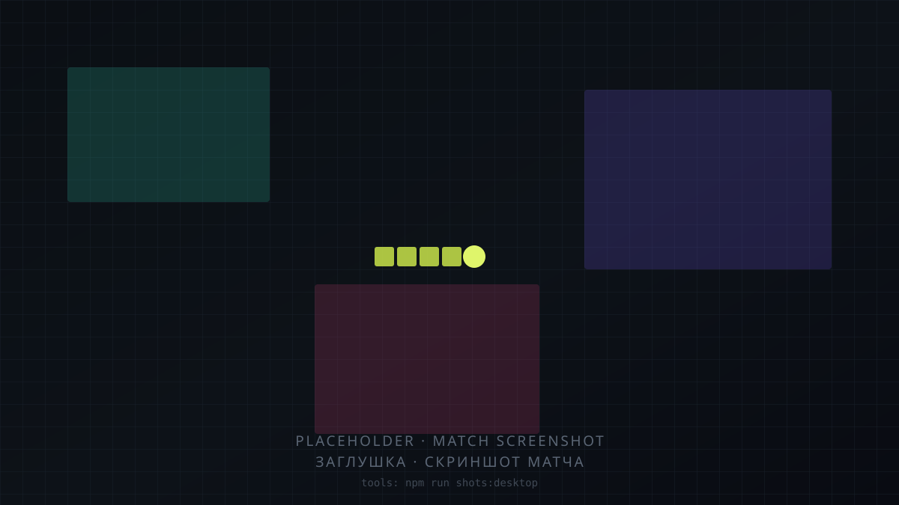
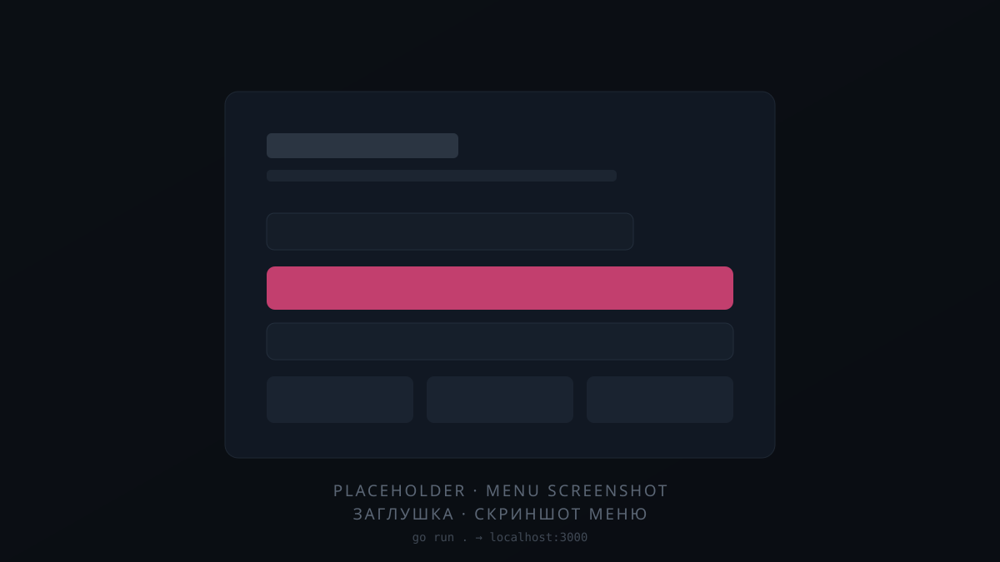

# Snakes

Русский · [English](README.en.md)

[](https://github.com/tr0llex/snakes/actions/workflows/ci.yml)
[](https://codecov.io/gh/tr0llex/snakes)
[](https://snakes.samoy.love)
[](LICENSE)

Многопользовательский захват территории в браузере — для тех, кому нужен матч
на пять минут и без регистрации: **[snakes.samoy.love](https://snakes.samoy.love)**,
одна вкладка, стрелки или свайп.

Выезжаешь за свою землю — за головой тянется след; замкнул петлю и вернулся
домой — всё внутри контура твоё. Наехали на след — теряешь территорию целиком.
Смерть стирает её не сразу: земля **остывает** пятнадцать секунд, и «Реклейм» в
это окно возвращает 55% связной области. Поражение превращается в короткое окно
на отыгрыш, а не в откат к нулю.

| Матч | Главное меню |
|---|---|
|  |  |

## Как устроено

**Свой бинарный протокол — потому что бюджет тика 100 мс.** Поле 200×140
клеток, и каждому клиенту надо ответить каждый тик; JSON такого объёма съел бы
бюджет одной только сериализацией. Состояние ходит бинарными кадрами — ROI,
события, чанки миникарты — с 21 типом игровых событий. Основной канал — ROI:
клиент получает только окно карты вокруг своей головы (по умолчанию 80×56
клеток, подогнано под вьюпорт), целиком или дельтой относительно тика, который
он подтвердил. Миникарта раскатывается чанками 10×10, дальше уезжают только
изменившиеся.

**Рассинхрон протокола ловится с двух сторон — потому что он ломал игру
молча.** Байтовая раскладка трижды за проект расходилась между сервером и
клиентом: страница открывалась, просто замолкали киллфид и баланс. Теперь
эталонные буферы снимаются с боевых Go-сериализаторов и лежат в репозитории как
данные, независимый JS-декодер прогоняет их поле за полем, а `public/client.js`
дополнительно сверяется с эталоном статически: у каждого типа события есть
обработчик, длины чтений и сумма смещений сходятся. Go-тест падает, если эталон
отстал от сериализаторов; node-тесты — если от эталона отстал клиент.

**Клиент без сборки — потому что выкатка идёт одним артефактом.** Vanilla JS
(ES-модули) и Canvas 2D: браузер грузит файлы как есть, ни npm-рантайма, ни
бандлера, ни фреймворка. Единственная сторонняя библиотека, twemoji, лежит
рядом в репозитории. Клиент и сервер делят бинарный протокол, поэтому едут
вместе, а кэш ломается версией в query на выкатке — см.
[docs/http.md](docs/http.md).

**Личность без аккаунтов — потому что форма входа стоила бы дороже, чем
защищает.** Ни паролей, ни почты: сервер выдаёт подписанный HMAC-SHA256 токен,
клиент предъявляет его при переподключении. Прогресс — баланс, косметика,
достижения — переживает перезагрузку страницы, а подделать чужой профиль
нельзя, см. [docs/security.md](docs/security.md).

**Боты, которых читаешь как соперников, — потому что пустая комната это мёртвый
продукт.** Свободные места добираются ботами: 14 при пустой комнате и тем
меньше, чем больше пришло людей, до четырёх. У них три тира сложности и четыре
архетипа поведения (Фермер, Агрессор, Трус, Территориальный), у каждого свой
аппетит к риску и своя длина заходов. Охота намеренно ограничена: не больше
трёх охотников на одну жертву, и перед броском бот несколько тиков идёт по
прямой — это видимый замах, на который человек успевает среагировать.

## Стек

**Клиент** — vanilla JS (ES-модули) и Canvas 2D, без сборки; интерфейс на
русском и английском, 349 ключей в каждом словаре.

**Сервер** — Go 1.25, единственная внешняя зависимость
`github.com/coder/websocket`. Никакой БД: профили лежат в JSON-файле, состояние
матча — в памяти. Метрики отдаются в текстовом формате Prometheus тремя
десятками собственных счётчиков, см. [docs/metrics.md](docs/metrics.md).

**Прод** — systemd-юнит `snakes.service` за системным nginx, релизы через
[deploy-kit](https://github.com/tr0llex/deploy-kit).

## Быстрый старт

Нужен Go 1.25+.

```bash
WS_ALLOW_LOCALHOST=1 go run .
```

Открыть <http://localhost:3000>. Статика раздаётся из `./public`
**относительно рабочей директории**, поэтому запускать надо из корня
репозитория, а профили лягут в `./data/profiles.json`.

`WS_ALLOW_LOCALHOST=1` здесь не для удобства: без него игра открывается, но не
играет. Пустой `WS_ORIGINS` означает не «origin не проверяется», а «разрешён
только свой», поэтому рукопожатие `/ws` с `http://localhost:3000` получает 403 —
меню и профиль на месте, а соединения нет. Дефолт в коде выключен намеренно:
включённым он позволял бы любой локально открытой странице предъявить валидный
Origin, и цена этой ошибки на проде выше, чем лишняя переменная локально.

Тем же способом сервер поднимает [deploy-kit](https://github.com/tr0llex/deploy-kit) —
`dk run snakes` берёт эту переменную из `.deploy-kit/prod.env` и не требует
помнить её вовсе.

Все настройки, их дефолты и причины — в [docs/config.md](docs/config.md);
шаблон для копирования — `.env.example`.

## Структура

| Путь | Назначение |
| --- | --- |
| `main.go` | Точка входа: окружение, роутинг (`/ws`, `/healthz`, `/readyz`, `/metrics`, статика), middleware, graceful shutdown |
| `internal/game/` | Игровое ядро вокруг `Room`: сетка и захват (`grid.go`), матчи и рассылка (`room.go`), боты (`bot_ai.go`), экономика — бонусы, контракты, ежедневки, ачивки, косметика (`economy.go`), сериализация на провод (`wire.go`), WebSocket-команды (`ws.go`) |
| `internal/protocol/` | Бинарный протокол: геометрия поля, коды событий, побайтовая раскладка |
| `internal/httpx/` | Транспорт: allowlist origin'ов, per-IP rate-limit, IP за прокси, заголовки и кэширование статики |
| `internal/profiles/` | Профили: HMAC-токены личности, атомарная запись, TTL, автосейв, лимиты |
| `internal/metrics/` | Счётчики и выдача `/metrics` в формате Prometheus |
| `internal/botnames/` | Пулы ников ботов и подбор уникального имени |
| `internal/sanitize/` | Единые правила чистки имён, чата, названий комнат и полей лога |
| `internal/envcfg/` | Разбор настроек из окружения |
| `public/` | Клиент: рендер, ввод, UI, сетевой слой, эффекты, звук |
| `tests/` | Клиентские тесты протокола на Node и эталонные буферы |
| `tools/` | Офлайн-стенд визуальной проверки; в браузер отсюда ничего не едет |
| `scripts/backup_profiles.sh` | Скрипт снимков: единственная защита прогресса игроков |
| `deploy/systemd/` | Таймер часовых снимков `profiles.json` и drop-in к `snakes.service`; сам `snakes.service` живёт только на сервере |
| `.deploy-kit/` | Описание цели выкатки |

Подробности — в [docs/](docs/): [протокол](docs/protocol.md),
[HTTP и кэширование](docs/http.md), [безопасность](docs/security.md),
[конфигурация](docs/config.md), [метрики](docs/metrics.md),
[тесты](docs/testing.md).

## Тесты

187 Go-тестов (398 вместе с подтестами) и 242 клиентские проверки в `tests/`.
Покрытие — 75.7% операторов в целом и 81.5% в `internal/game`; цифра в бейдже
берётся из Codecov, а не из этого файла.

```bash
make test-all          # go test + node --check + клиентские тесты протокола
make test-race-docker  # -race в контейнере, gcc на хосте не нужен
make golden            # перегенерировать эталон протокола после его изменения
```

Гейт CI: gofmt, `go vet`, staticcheck, сборка, `go test -race -short` и полный
прогон без детектора, `node --check` по клиенту и 58 протокольных проверок,
которые держат клиент и сервер в согласии. Красный прогон останавливает
выкатку. Подробности и особенности Windows — [docs/testing.md](docs/testing.md).

## Выкатка

```bash
dk deploy snakes          # выкатить
dk rollback snakes --list # какие релизы лежат на сервере
```

Атомарные релизы с автооткатом; клиент и сервер едут **одним артефактом** —
разъехавшиеся версии ломают разбор пакетов. Конфигурация nginx и сами скрипты
релиза — в [deploy-kit](https://github.com/tr0llex/deploy-kit); в этом
репозитории лежит только описание цели `.deploy-kit/prod.env`.

Профили игроков — единственные данные, которых нет больше нигде. Их снимает
systemd-таймер: 48 часовых копий и 14 суточных, снимок с битым JSON
отвергается.

## Часть samoy.love

`samoy.love` читается как фамилия владельца — Самойлов. Один домен, один
сервер, один релизный пайплайн, одна статус-страница.

| Сервис | Что это | Репозиторий |
| --- | --- | --- |
| [samoy.love](https://samoy.love) | Личная страница и витрина проектов | [tr0llex/samoy.love](https://github.com/tr0llex/samoy.love) |
| [snakes.samoy.love](https://snakes.samoy.love) | Эта игра | [tr0llex/snakes](https://github.com/tr0llex/snakes) |
| [metro.samoy.love](https://metro.samoy.love) | Офлайн-PWA со схемой московского метро | [tr0llex/metro-map](https://github.com/tr0llex/metro-map) |
| [launcher.samoy.love](https://launcher.samoy.love) | ChillHub, лаунчер игр для Windows | [tr0llex/chillhub](https://github.com/tr0llex/chillhub) |
| [status.samoy.love](https://status.samoy.love) | Аптайм, версии, инциденты | [tr0llex/status.samoy.love](https://github.com/tr0llex/status.samoy.love) |
| Мониторинг | Prometheus, Grafana, посещаемость из логов nginx | [tr0llex/metrics.samoy.love](https://github.com/tr0llex/metrics.samoy.love) |

Все они едут одним инструментом,
[deploy-kit](https://github.com/tr0llex/deploy-kit): одно описание цели в
репозитории, один `release.sh` на сервере, одна конфигурация nginx на всех.
Добавить в этот ряд новый сервис стоит одного файла `.deploy-kit/*.env`.

## Контакты и лицензия

Алексей Самойлов — <alex@samoy.love>, [t.me/tr0llex](https://t.me/tr0llex),
[github.com/tr0llex](https://github.com/tr0llex).

MIT, см. [LICENSE](LICENSE). Сторонние ресурсы в поставке сохраняют свои
условия: [docs/notices.md](docs/notices.md).
